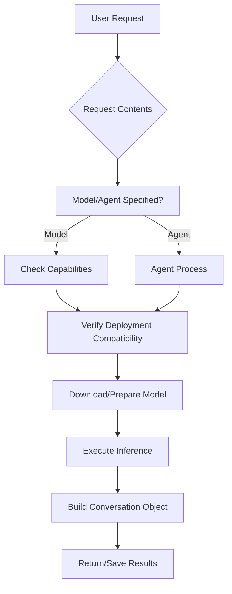

# CLAIA Architecture
This document outlines the architecture of the CLAIA system. It is an evolving document that will be updated as the system develops.

## Overview
CLAIA is a modular system designed to facilitate AI agent interactions, deployments, and conversations. The architecture follows several design patterns including event-driven architecture, command pattern, and repository pattern to create a flexible and extensible system.


# CORE CONCEPTS

## Model System
The model system handles AI capabilities and deployment configurations:

- **Capabilities**: Defines what a model can process/produce:
  - Text (generation, analysis)
  - Images (generation, transformation)
  - Audio (speech synthesis, analysis)
  - Multimodal combinations

- **Repository Types**:
  - HuggingFace Hub
  - Local model directory
  - Custom S3 bucket
  - Private model registry
  - API endpoints

- **Deployment Methods**:
  - Local inference (direct model loading)
  - API client (3rd party services)
  - Remote deployment (self-hosted cloud)
  - Hybrid (model partitioning)

## Request Processing


# CLAIA SYSTEM

## Core Components (Updated)
- **Model System**: Handles model capabilities, repositories, and deployments
- **Request Queue**: Manages incoming processing requests
- **Agent Processor**: Routes requests to appropriate handlers
- **Conversation Engine**: Maintains context and multimodal outputs
- **Deployment Manager**: Handles model preparation/execution
- **Storage System**: Persists conversations and artifacts

## Request Handling Lifecycle
1. Request ingestion:
   - Contains: model/agent spec, conversation context, deployment preferences
   - Example format:
     ```json
     {
       "model": "exofox/image-gen-v5",
       "repository": "s3://models.exofox.ai",
       "deployment": "remote-aws-g5",
       "conversation": {...}
     }
     ```
2. Queue prioritization and dispatch
3. Handler selection:
   - Direct model execution if specified
   - Agent process if defined
   - Default handler (auto-select based on capabilities)
4. Model preparation:
   - Repository authentication
   - Deployment environment setup
   - Capability verification
5. Execution and conversation building
6. Result delivery and storage

## Deployment Coupling
Repository and deployment relationships:

| Repository Type     | Supported Deployment Methods           |
|---------------------|----------------------------------------|
| HuggingFace Hub     | Local, API, Hybrid                     |
| Local Directory     | Local, Remote Deployment               |
| S3 Bucket           | Remote Deployment, Hybrid              |
| Private Registry    | Remote Deployment, API                 |
| API Endpoints       | API Client                             |

## Conversation Structure
Unified object format for multimodal interactions:
```xml
<Conversation>
  <Context>
    <SystemPrompt>...</SystemPrompt>
    <Memory>...</Memory>
    <Artifacts>
      <Image ref="img123"/>
      <Audio ref="aud456"/>
    </Artifacts>
  </Context>
  <Interaction>
    <UserInput>...</UserInput>
    <ModelResponse model="exofox/image-gen-v5">
      <Image src="generated_img.jpg"/>
      <Analysis>Generated landscape image</Analysis>
    </ModelResponse>
  </Interaction>
</Conversation>
```

## Core Components
CLAIA consists of several interconnected components:

- **Model**: Core AI models and their capabilities
- **Deploy**: Deployment mechanisms and infrastructure
- **Tools**: Utilities that extend functionality
- **Conversation Model**: Handles dialogue and interactions
- **Data/RAG/Memory**: Information storage and retrieval
- **Commands/Processes**: Action execution framework
- **Modules**: Pluggable components for extending functionality
- **Agent**: Different agent types and behaviors


# ARCHITECTURE

## Deployment Flow

```
                  ┌─────────────┐
                  │             │
                  │  claia      │ ◄─────┐
                  |  host 1     |       |
                  │             │       │
                  └─────┬───▲───┘       │
                        │   │           │
                        │   │           │
                        ▼   │           │
┌─────────┐       ┌─────────────┐       │
│         │       │             │       │
│  API    ├──────►│  claia      │       │
│         │       │  server     ├───────┤
└────┬────┘       │             │       │
     │            └─────┬───▲───┘       │
     │                  │   │           │
     │                  │   │           │
     │                  ▼   │           │
     │            ┌─────────────┐       │
     │            │             │       │
     │            │  claia      │       │
     │            │  host 2     ├───────┘
     │            │             │
     │            └─────────────┘
     │
     ▼
┌─────────┐
│         │
│   DB    │
│         │
└─────────┘
```

Deployment process:
- Deployer can designate groups to agents
- Deployer inspects job, looks at available agents
- Forwards model (job) to model (agent/group) for faster responses
- Process setup if no match
- If model doesn't exist, check model (or agent) requirements and job requirements
- Deploy inference agents or groups
- Idle/new agents as necessary


# CLAIA FEATURES

## Use Cases
- Library (for product integration)
- Client (end user direct CLI interaction)
- Autonomous Agent/Bot (may be a translation of the two roles above or a mix of the "agent" feature)
- ExoFox AI Service

## Pricing Tier Ideas
- Potentially Freemium model tier with rate limits
- Premium model tier with Premium rate limits & speeds
- Pay-per-usage or monthly with Premium usage cap
- Buy hours/credits vs $?

## Storage
- ExoFox AI Storage (S3 bucket/slate endpoints)
- Provided storage to store:
  - Prompts
  - Artifacts
  - History/conversations
  - Logs
  - RAG type memory

## Cost Structure
- Per job cost?
- Accessing cost?
- Premium allowances for the above?

## Features

### Modules
Allow implementation-specific "mods" to create commands or scripts that can take advantage of claia's tools. Because of the library use case where claia becomes the executor.

### Custom Conversation Framework
A platform framework to transition smoothly between various modalities & preserve conversation context.

### XML Tags
- `<Image src="..." w="..." h="..." />`
- `<File />`
- `<Memory />`
- `<Sys Prompt />`
- `<Audio src="..." />`
- `<Thought src="agent" />`
- `<Prompt src="user" />`
- `<Correction src="user" />`
- `<Response src="agent" model="gpt" />`

### Hive
Claia may spawn several child processes for distributed inference, multithreaded performance, remote model loading, agentive processes, etc.

### Hive Grouping
A hive process that can group several remote instances for resource pooling, where instances in the group can intercommunicate.

### Tools
Create tools that the agent can use for various use cases:
- Console commands
- Browser/crawler
- Long context memory DB generation
- Self love training or contextual improvement
- Model selection
- Misc: calc, count, think, time, date, weather
- Call/text?
- Artifacts

### Deployments
"Your Choice" Deployments: interact with AI using any method you prefer:
- Some machines self deploy & self optimize size for hardware resources
- Remote deploy using your accounts
- Use ExoFox AI service (default?)
- Your API

### Storage
"Your Choice" Storage: instances can stream results directly back to the initiating instance to store data locally or in memory, or you can choose Exafor AI storage or an S3 style bucket of your choosing.

### Agent
Agentive processes such as contextual model switching.


# PRODUCTION
Some features may not be suitable to production deployments

User Access Control:
- intentionally avoided in Claia due to the complex nature
- would need to be implimented for access to data stores for privacy in multiuser deployments
- tools would likely need the same user access control to avoid AI models calling tools that can't run with user data access

Database Storage:
- intentionally avoided in Claia to keep things simple, small, and modular
- some data may be better suited to pull from a database
- large ammounts of data may suffer from the file based storage design in Claia

Commands:
- commands are used for user interactivity and are better avoided for production in favor of environment variables or cli args

Agent:
- the agent functionality is the star of the show when it comes to Claia
- however, due to tight coupling the integrated agent functionality may be limited in its usefulness for production deployments
- it may be better to build an agent system outside of Claia that leverages Claia's conversation model and deployment capabilities


# PIECES
Here are the core pieces of Claia's code:
- Commands
  - Used in Claia to initiate processes and change settings
  - Can also be used by the AI models if enabled, therefore doubling as AI "tools"
- Models
  - A library of models and capabilities
  - Also defines what models can be deployed with what services
  - More or less a dictionary of models that can be used in deployments and from agent processes
- Deploy
  - Deploy or connect to a specific model if requested by an agent process
  - Controls any 'Hives' of resources
  - Multithreaded if necessary for agent processes
- Structures (Conversation & Data)
  - Defines the conversation format and structure
  - Defines various file structures to load, store, convert, and parse various file types
- Storage (Data Files, Memory, RAG)
  - Uses the structures to define processes to load and store various data components for the agent systems
- Agents
  - Processes and sequences of processes that utilize and deploy various models as needed to process a request
  - The simplest agent is a simple wrapper for a requested model
  - All requests start here, once popped from the queue a request is sent to an agent

## Updated Considerations
- **Model Isolation**: Each model deployment runs in isolated environments
- **Capability Enforcement**: Strict validation of model capabilities vs requests
- **Deployment Fallbacks**: Automatic fallback to API mode if local deployment fails
- **Queue Persistence**: Request queue survives restarts

# Concept Draft

## Process Overview
- Processes from the queue are sent to their respective agents
- The agent process will break down the request and create a list of processes (or sequentially create processes based on the result of a previous process)
- These child processes will be added back into the queue for processing
- To maintain the state, each process will have a conversation object, which will store all necessary metadata, including references to file objects
- To execute the necessary process, the agent will send the conversation object to the specified model or process and use the result to determine the next step

## Part Concepts

### Artifacts
- A file is created by the agent and attached to the conversation
- A process can recursively update this file with suggestions from the model
- See Claude prompt for more ideas (files/claude_artifact_prompt.xml)

### Input/Output formats
- Depending on the model type, this can be one of several types that may fall within model capabilities, or may be included in the process type
- The formats include:
  - Text
  - Audio (voice, sound, music)
  - Image (style?)
  - Video

### Conversation
- Each conversation is a collection of user/agent request/response pairs
- Each request/response is defined with a type
- That type defines how each request/response is processed to send to models or display to userr
- A conversation object will have a list of file object references
- The file objects will be correspond with their file types (including processing methods)
- The file objects will contain a path to the file, but won't keep the file loaded in memory
- Text is stored directly in the conversation object/history file
- Text may also be a file object in the case of artifacts so it may be edited between responses

### Model Definitions
- The agent manages it's processes and the sources (deployments) manage loading the hardware
- The model definitions are the glue for both parts
- Each part of the agent process uses a specific model and passes that along with the conversation object to the source
- The model contains information:
  - model details (max context length, model size, description)
  - model capabilities (text to text, text to speech, text to image, etc.)
  - model sources (which sources support which model, prices, limitations)
  - model repositories (which repositories contain the model)

### Deployment Strategies
- Claia instances are used to deploy models
- Claia uses grpc as a cross server communication protocol
- Claia multi instance deployments are known as the "Hive"
- Claia instance manager (or parent process) is known as the Hive's "Champion"
- Deployment Types
  - VM
  - Container
- Deployment Processing Units
  - CPU
  - GPU
  - NPU
  - ASIIC
- Deployment Services
  - MassedCompute (VMs)
  - Runpod (Containers)
  - Vast (Containers)
  - Jarvis Labs?
  - Lambda Cloud?
  - DataCrunch?
  - LeaderGPU?
  - Amazon (Variety, pricey but higher availability?)
  - Google (Variety? pricey but higher availability?)
  - Azure?
- [x] Phase 1: API support
- [ ] Phase 2
  - Based on the size of the model, deploy an appropriate sized Nvidia VM or Container
  - Use the lowest price across MassedCompute or Runpod deploying either a VM or a Container respectively
  - Test speed vs cost for throughput benefit analysis
- [ ] Phase 3: Support local model loading
- [ ] Phase 4: Support multiple model memory management (load multiple models on a single computer)
- [ ] Phase 5: Auto scaling
- [ ] Phase 6: Support cross network inference, "Hive" models (may need practical speed testing before full implimentation)
- [ ] Phase ?
  - Add Rocm support for AMD GPUs
  - Investigate NPU support
  - Investigate ASIIC support